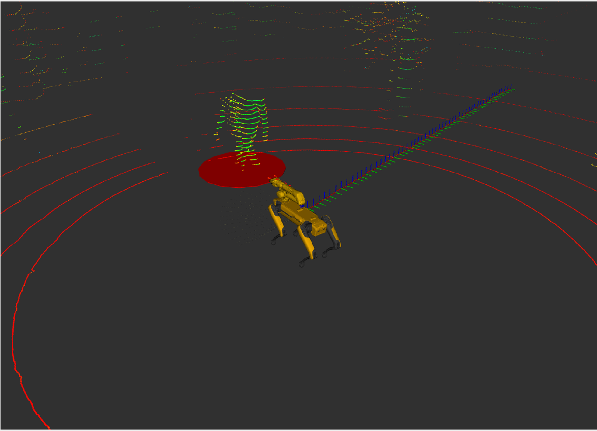

# spot-human-trajectory-prediction

More information about creating ROS2 package can be found [here](https://docs.ros.org/en/humble/Tutorials/Beginner-Client-Libraries/Creating-Your-First-ROS2-Package.html)

# Running the package

```
git clone https://github.com/harshaguda/spot-human-trajectory-prediction.git
cd spot-human-trajectory-prediction
pip install -r requirements.txt
cd ros2_ws/src/yolov8_tracking/yolov8_tracking
python3 track_ros_rb.py
cd ros2_ws/src/human_trajectory_prediction/human_trajectory_prediction
python3 danger_zone_publisher.py
python3 prediction_node.py
```
If you find issues with visualizing in RViz, try running a ros bag and visualize it, then without closing RViz stop the rosbag and run the above python script.
# Results

